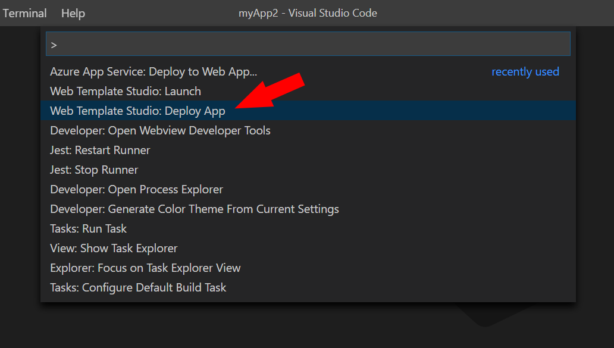
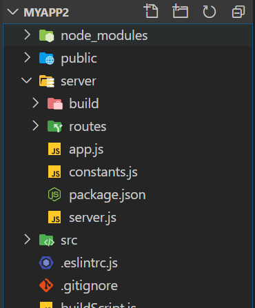
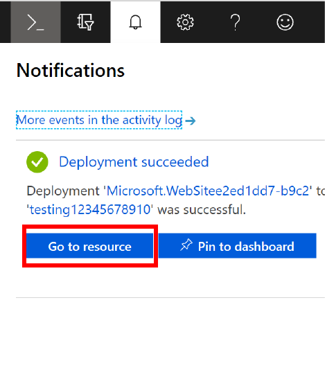

# Deployment

After implementing your business logic, we recommend deploying your website to the cloud.
Deploying your website to the cloud allows people to view your website by visiting a URL.

## Azure App Service

One way to deploy is using Azure App Service. This service will allow you to deploy and scale web, mobile and API apps.

## Web Template Studio: Deploy App command (Recommended)

NOTE: Make sure that the [Web Template Studio](https://marketplace.visualstudio.com/items?itemName=WASTeamAccount.WebTemplateStudio-dev-nightly) and [Azure App Service](https://marketplace.visualstudio.com/items?itemName=ms-azuretools.vscode-azureappservice) extensions are installed in visual studio code.

The easiest way to deploy an application generated with Web Template Studio is to use the `Web Template Studio: Deploy Application` command. To execute this command, follow these steps:

1. Open the application generated with Web Template Studio in Visual Studio Code.
   
2. Press `Ctrl + Shift + P` on Windows/Linux or `Command ⌘ + Shift + P` to open the Command Palette.
   
3. In the Command Palette, type `Web Template Studio: Deploy App` and press `Enter` to launch the deploy.



Web Template Studio will begin preparing the application for deployment. You can see the progress in the Visual Studio Code output. In addition, a notification will be launched for each step executed.

 - It will run the `npm install` command to install all the necessary dependencies for the frontend and the backend apps.


  
 - Creating a Production Build:  creates a build directory with a production build of your frontend app.


 
 - Copy the build directory to `server/build`. In this way, the `server` folder will contain all the necessary frontend and backend files for the deployment.


  
 - Web Template Studio will automatically launch the command `Azure App Service: Deploy to Web App...`, which will be in charge of deploying the application to an Azure App Service.

    - If you have added an Azure App Service when creating your application with Web Template Studio, the application already has a deployment configuration, so it will use the created Azure App Service.

    - Otherwise, Visual Studio Code will ask you for the deployment directory and if you want to create a new Azure App Service or use a previously created. 
    
       **IMPORTANT**:exclamation: -  Remember to select the `server` folder for deployment to be successful.
  

  
  - Start the application deployment to Azure App Service. We can see the progress of the deployment in the output of the Azure App Service extension.
  

  
  - At the end of the deployment, Visual Studio Code shows us a notification that the deployment has been successful.
  


## VS Code Extension Method

The Azure App Service Extension provides an easy way to manage and deploy your web application.

1. Download the [Azure App Service Extension](https://marketplace.visualstudio.com/items?itemName=ms-azuretools.vscode-azureappservice).
2. Open the project in Visual Studio Code, and run `yarn build` or `npm build`.
3. Move the build folder into the server folder.
4. Click the deploy button in the Azure App Service Extension.


5. When prompted on which folder to deploy, select the server folder.
6. Click yes when prompted to update your configuration to run `npm install` on the target server.


7. If you are using a Cosmos Database add the Cosmos Keys in the .env file to the Application Settings of your Azure App Service. To run the app in production mode set the variable NODE_ENV to production in your Application Settings. You can add an Application Setting by right clicking the Application Settings tab in the Azure App Service Extension.


8. Consider adding authentication and securing back-end APIs by following [Azure App Service Security](https://docs.microsoft.com/en-us/azure/app-service/overview-security).

## Local Git Deployment Method

This method will require you to have [git](https://git-scm.com/downloads) installed on your computer.

#### Creating the App Service through the Azure Portal

- Go to the [Azure Portal](https://portal.azure.com) and click on the _App Services_ button.

  

- Click on the _Add_ button in the new window that appears.

  

- Click the _web app_ button.

  

- You will be presented with another screen on which you should click _create_.

  

- Another screen will appear in which you are required to do the following actions:

1. Enter the name of the website in the _app name_ field.
2. Select a subscription.
3. Create a resource group or use an existing one.
4. Select the publish _code_ option.
5. If no _app service_ exists create an _app service_ on this screen (costs money but required if one doesn't already exist).
   1. Click on the _App service_ button and you will be to create a new app service.
   2. If creating an _app service_ name it and select a location, and finally select the tier you want.


6. Click create resource.


- After clicking create you will get a notification. Click the bell icon on the top right to view notifications, then click the _go to resource_ button.



You now have an app service resource in the cloud, where you can upload your web application.

#### Deploying the website to the App Service

To be able to deploy your web application, you will need to do the following set of commands in either _terminal_ or _git bash_. **Note: you must be in the root of your generated project's directory**.


`npm install && npm build` or `yarn install && yarn build`

You should then have a build folder in the root directory. Run the following command to move the production build of your client side into the server folder. Doing so will remove any prior builds.

`rm -rf server/build && mv build/ server/`

You will then want to `git init` to make the root directory a local git repository.

Finally, run the following command to create a .deployment file with the proper parameters.

```
echo "[config]
project=server" > .deployment
```

Follow the documentation created by the Azure team for [deploying with a local git repository](https://docs.microsoft.com/en-us/azure/app-service/deploy-local-git#open-azure-cloud-shell)

Your newly deployed web app can be found at `<app name>.azurewebsites.net`
